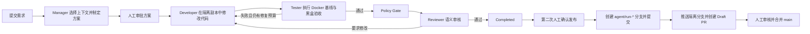

# 多智能体软件开发助手

> 一个本地运行、人工审批、可审计的多智能体 Coding 工作台：让 Manager、Developer、Tester 和 Reviewer 在隔离环境中协作完成真实代码改动，并通过 Git 分支安全交付。

本仓库采用 monorepo 结构，同时保存多智能体控制服务、被验证的学生管理示例项目、测试评估材料和设计文档。当前版本适合在 Windows 本机完成“提出需求 → 审核方案 → 生成代码 → Docker 测试 → 人工确认发布”的完整演示。

## 仓库结构

```text
Mutil_Agent/
├─ agent-assistant/       # 多智能体控制服务、控制台、测试与 Docker Runner
├─ student-management/    # 示例真实项目：FastAPI 后端 + Vue 前端
│  ├─ backend/
│  ├─ frontend/
│  └─ docs/
├─ gan-harness/           # 独立评估规范、量表和评估结果
├─ plans/                 # MVP、真实 LLM 接入等实施方案
├─ start-all.ps1          # Windows 本机一键启动脚本
└─ *.md                   # 项目总体方案与流水线设计
```

## 多智能体如何协作



`completed` 只表示隔离副本通过测试和审核，不表示真实项目已经修改，也不表示远程仓库已经合并。真实文件发布和远程合并分别需要独立的人工确认。

## 快速启动

### 环境要求

- Windows PowerShell
- Python 3.12 或 3.13
- Node.js 与 npm
- Docker Desktop（执行真实 Coding run 的基线和黑盒验收时必需）

### 首次安装

安装多智能体控制服务：

```powershell
cd D:\AI_multi_agent\agent-assistant
python -m venv .venv
.\.venv\Scripts\python -m pip install --upgrade pip
.\.venv\Scripts\python -m pip install -r requirements.lock
```

安装学生管理项目：

```powershell
cd D:\AI_multi_agent\student-management\backend
python -m pip install -r requirements.txt

cd ..\frontend
npm install
```

### 一键启动

在仓库根目录执行：

```powershell
powershell -ExecutionPolicy Bypass -File .\start-all.ps1
```

当前 `start-all.ps1` 是 Windows 本机开发快捷脚本，默认使用 `D:\AI_multi_agent` 和 `D:\develop_tools\Anaconda\python.exe`。如果仓库或 Python 位于其他位置，请先修改脚本中的 Python 路径和三个工作目录。

启动成功后访问：

| 服务 | 地址 |
| --- | --- |
| 多智能体中文控制台 | <http://127.0.0.1:8080/console/> |
| 多智能体 API 文档 | <http://127.0.0.1:8080/docs> |
| 学生管理前端 | <http://127.0.0.1:5173/> |
| 学生管理后端 API 文档 | <http://127.0.0.1:8000/docs> |

控制台所需令牌由服务首次启动时写入 `agent-assistant/runtime/control-token`。

### 分别启动

需要独立排查某个服务时，请打开三个 PowerShell 窗口：

```powershell
# 窗口 1：多智能体控制服务
cd D:\AI_multi_agent\agent-assistant
.\.venv\Scripts\python -m app
```

```powershell
# 窗口 2：学生管理后端
cd D:\AI_multi_agent\student-management\backend
python -m uvicorn app.main:app --host 127.0.0.1 --port 8000
```

```powershell
# 窗口 3：学生管理前端
cd D:\AI_multi_agent\student-management\frontend
npm run dev
```

真实 LLM 的 Provider 配置、模型协议差异和完整操作流程请阅读 [agent-assistant 使用文档](agent-assistant/README.md)。密钥只应保存在被 Git 忽略的本机 `.env` 中，不要写入 README、提交记录、任务描述或截图。

## Git 安全交付模型

仓库以根目录作为唯一 Git 边界，`student-management/` 是其中一个受管项目子目录。

- 首次导入使用 `bootstrap/monorepo-v0.4` 分支，经检查后创建 Draft PR，由人合并到 `main`。
- 每个获准发布的 Coding run 使用独立的 `agent/run-{run_id}` 分支，只提交 Reviewer 审核过的精确文件。
- 根仓库存在任何未提交改动时，自动发布会拒绝继续，防止覆盖或夹带人工工作。
- 远程推送必须再次获得操作者授权；只推送隔离分支，再创建 Draft PR。
- `main` 始终由人审核后合并；禁止直接推送、强制推送、自动合并或自动删除远程分支。
- `.env`、运行数据库、日志、缓存、`node_modules` 和构建产物不会进入版本库。

当前应用自动完成的是本地 `agent/run-*` 分支和受审核 commit；远程推送、Draft PR 与合并仍由操作者明确授权和执行。

## 验证

运行控制服务的完整测试：

```powershell
cd D:\AI_multi_agent\agent-assistant
.\.venv\Scripts\python -m pytest -q
```

当前验证基线（2026-08-20）：

- `195 passed`
- `10 skipped`（既有 Docker 或平台条件测试）

## 文档导航

- [多智能体控制服务：安装、配置、API 与发布说明](agent-assistant/README.md)
- [MVP 设计蓝图](plans/Multi-Agent软件开发智能助手_MVP设计蓝图.md)
- [真实 LLM 接入与通用 Coding 能力改造方案](plans/真实LLM接入与通用Coding能力改造方案.md)
- [V3 落地方案](Multi-Agent软件开发智能助手_V3落地方案.md)
- [多角色协同开发流水线优化版](AI多角色协同开发流水线_优化版.md)
- [学生管理系统 PRD](student-management/docs/PRD-v2.md)
- [独立评估规范](gan-harness/spec.md)
