# 多智能体软件开发助手（v0.3.1 Monorepo Git 安全交付版）

本目录是已审核 MVP 蓝图的第一个可执行纵向切片。它是一个运行在本机的 FastAPI 控制服务，包含四个逻辑角色：

- Manager：分析需求并生成实施方案
- Developer：根据已审批方案生成代码改动
- Tester：在隔离的 Docker 容器中运行测试
- Reviewer：检查需求覆盖情况并给出最终评审结论

当前版本支持三种 Provider：`mock`、OpenAI Responses API（`openai`）和 DeepSeek Chat Completions（`deepseek`）。真实模式会让 Manager、Developer、Reviewer 调用用户在本机 `.env` 中配置的模型；Tester 始终是本地确定性 Docker 执行器，不调用 LLM。

## 当前已经实现

- 通过 API 创建任务，并将任务状态持久化到 SQLite。
- Worker 使用单调递增的 fencing token 领取任务，防止旧 Worker 写入新任务代次。
- Manager 先从仓库索引选择最小文件集合，再基于获准内容生成结构化方案，并在执行代码修改前暂停等待人工审批。
- 审批同时绑定计划、项目配置、源码快照、上下文和 Acceptance Pack 哈希，过期或被篡改的审批会被拒绝。
- 只将项目配置允许的文件复制到隔离工作副本，不直接修改原项目。
- Developer 通过结构化 `ChangeSet` 修改隔离工作副本。
- Tester 运行不可变的基线测试和双容器 HTTP 黑盒 Acceptance Pack；SUT 看不到验收测试源码。
- 测试失败后最多允许两轮 Developer 修复。
- Reviewer 要求修改后最多允许一轮修复，并重新运行测试。
- 在语义评审前执行不可绕过的确定性 Policy Gate。
- SQLite 保存审批边界、租约、事件与 LLM 调用元数据；源码正文和密钥不会写入调用审计表。
- 输出代码 Diff、测试日志、事件时间线、最终报告和不透明的制品 ID。
- 提供本机中文可视化控制台，可查看角色时间线、方案、Diff、测试、Reviewer 结论和 LLM 调用审计。
- `completed` 后仍不修改真实项目；只有操作者再次确认项目配置、源码快照和 Diff 三项哈希，才会进入独立的发布流程。
- 发布前要求配置中冻结的根 Git 仓库处于指定基线分支且全仓干净，并将仓库根、项目子路径、远程地址、当前分支和 HEAD commit 绑定到二次确认请求。
- 当前项目位于 monorepo 子目录 `student-management/`。每次发布创建 `agent/run-{run_id}` 独立分支，只允许把 Reviewer 已审核的项目相对路径映射为 `student-management/...` 后精确提交；写入后重新运行 Baseline 与 Acceptance，全部通过才生成自动 commit。
- 发布仍保留逐文件原子替换和持久化回滚日志；失败或进程中断会恢复原始字节、切回原分支并删除未完成分支，遇到并发人工改动则停止并要求人工恢复。
- 每个租约 generation 使用独立工作区和独立 checkpoint，避免旧 Worker 干扰当前执行。
- 执行期间自动续租；丢失租约时停止对应 generation 的 Docker 容器。
- 取消请求会进入持久化的 `cancelled` 终态。

## 系统流程

```mermaid
flowchart LR
    M0["Manager<br/>选择最小上下文"] --> M["Manager<br/>生成方案"]
    M --> A["人工审批"]
    A --> D["Developer<br/>生成改动"]
    D --> T["Tester<br/>Docker 测试"]
    T -->|失败，未超过预算| D
    T -->|通过| P["Policy Gate<br/>确定性安全校验"]
    P --> R["Reviewer<br/>语义评审"]
    R -->|要求修改| D
    R -->|通过| C["Completed<br/>生成补丁和报告<br/>尚未修改真实项目"]
    C --> PA["第二次人工确认<br/>绑定三项哈希 + 仓库/远程/Git HEAD"]
    PA --> GB["创建 agent/run-* 分支"]
    GB --> PUB["写入真实项目<br/>Baseline + Acceptance 复验"]
    PUB -->|失败| RB["按持久化日志回滚"]
    PUB -->|通过| GC["生成单一 Git commit"]
    GC --> DONE["Published"]
```



## 安全边界

正式测试执行仅允许使用 Docker，不提供宿主机命令执行器，也不会在 Docker 失败时退回宿主机执行。Baseline 使用无网络单容器；Acceptance 使用独立的 SUT + Driver 双容器和内部网络。项目配置中保存了已验证的 Docker 镜像摘要；镜像不存在或摘要不匹配时，任务会失败关闭。

Docker Runner 当前启用了：

- Baseline 使用 `--network none`；Acceptance 仅连接每个 run 独立的 Docker internal network
- 非 root 用户
- `--read-only`：只读容器根文件系统
- `--cap-drop ALL`
- `no-new-privileges`
- CPU、内存、PID、文件大小和超时限制
- SUT 只读挂载工作副本，Driver 只读挂载验收测试，双方不能读取对方文件
- stdout 和 stderr 各自限制为 5 MiB
- 不向容器提供可写的宿主机目录

控制 API 还包含以下保护：

- 只接受 loopback 请求
- 校验 HTTP Host
- 所有 `/api/v1` 接口都要求 Bearer Token
- API 不接受原始制品路径，只接受不透明的 `artifact_id`
- 下载制品时重新校验文件大小和 SHA-256
- `.env`、密钥、数据库、二进制文件等敏感内容不会被复制到工作副本
- 发布接口只接受已完成 run，且必须显式回传预检产生的项目配置哈希、源码清单哈希、Diff 哈希、原分支、Git 基线 commit、目标分支、远程名称和远程 URL
- 如果真实项目从 run 创建后发生任何受管文件漂移，发布会失败关闭，要求创建新 run
- 如果根 Git 仓库存在任何未提交内容，即使位于 `agent-assistant/`、`plans/` 等受管项目范围以外，发布也会失败关闭，避免覆盖或夹带人工工作
- Git 暂存前、暂存后和 commit 后都会把每个 blob 的 SHA-256 与 Reviewer 审核过的原始字节逐一对比；交付器执行的所有 Git 命令都会禁用仓库 hooks，clean filter、换行转换或并发修改只要改变内容就会触发回滚

自动化测试使用的 `ScriptedRunner` 只是一个不启动进程的测试替身，不代表真实验收结果。真实验收必须由 Docker Runner 完成。

## 环境要求

- Windows PowerShell
- Python 3.12 或 3.13
- Docker Desktop
- Docker 使用 Linux 容器模式

## 安装

在新的 PowerShell 窗口中执行：

```powershell
cd D:\AI_multi_agent\agent-assistant
python -m venv .venv
.\.venv\Scripts\python -m pip install --upgrade pip
.\.venv\Scripts\python -m pip install -r requirements.lock
.\.venv\Scripts\python -m pytest -q
```

如果当前环境已经安装依赖，也可以直接在项目目录运行测试：

```powershell
python -m pytest -q
```

## 构建 Docker Runner

先启动 Docker Desktop，然后执行：

```powershell
cd D:\AI_multi_agent\agent-assistant\docker\python-fastapi-runner
docker build --provenance=false -t ai-agent/python-fastapi-runner:2026-08-11 .
docker image inspect ai-agent/python-fastapi-runner:2026-08-11 --format '{{.Id}}'
```

当前配置冻结的镜像摘要位于：

```text
config/projects/student-management-backend.yaml
```

如果重新构建后得到不同的 `sha256:...`，需要把新的摘要写入该文件的 `runner_digest` 字段。项目配置发生变化后，旧任务的审批将自动失效，必须创建新任务。

同一配置还冻结了 Git 交付边界：

```yaml
source_path: ../../../student-management
repository_path: ../../..
remote_name: origin
base_branch: main
branch_prefix: agent/run-
```

`source_path` 是被修改和测试的项目目录，`repository_path` 是唯一允许操作的 Git 根。系统会验证前者确实位于后者内部，所有 Git 命令只在受信仓库根执行；模型和 API 都不能改写这些路径。

## 配置真实 LLM

复制 `.env.example` 为未提交的 `.env`，填写以下字段：

DeepSeek 官方接口：

```dotenv
PROVIDER_MODE=deepseek
LLM_API_KEY=你的 DeepSeek 密钥
LLM_BASE_URL=https://api.deepseek.com
LLM_MODEL=deepseek-v4-flash
```

也可以改用 `DEEPSEEK_API_KEY`、`DEEPSEEK_BASE_URL`、`DEEPSEEK_MODEL`，或分别设置 `DEEPSEEK_MANAGER_MODEL`、`DEEPSEEK_DEVELOPER_MODEL`、`DEEPSEEK_REVIEWER_MODEL`。DeepSeek 模式按照官方文档调用 Chat Completions JSON Output，并显式关闭思考模式，避免思维链占用结构化 JSON 的输出额度；所有结果仍会在本地执行 Pydantic schema 校验。

如果连接 OpenAI Responses API：

```dotenv
PROVIDER_MODE=openai
LLM_API_KEY=你的 OpenAI 密钥
LLM_BASE_URL=https://api.openai.com/v1
LLM_MODEL=你的模型 ID
```

OpenAI 模式也可以使用 `OPENAI_API_KEY`、`OPENAI_BASE_URL`、`OPENAI_MODEL`，或角色专用的 `OPENAI_*_MODEL`。真实模式配置缺失时服务会拒绝启动；密钥不会出现在任务、事件、制品和 LLM 调用审计接口中。

切回完全离线的确定性演示：

```dotenv
PROVIDER_MODE=mock
```

## 启动服务

在项目根目录执行：

```powershell
cd D:\AI_multi_agent\agent-assistant
.\.venv\Scripts\python -m app
```

如果没有使用虚拟环境：

```powershell
python -m app
```

服务固定监听：

```text
http://127.0.0.1:8080
```

Swagger 操作页面：

```text
http://127.0.0.1:8080/docs
```

推荐使用中文可视化控制台：

```text
http://127.0.0.1:8080/console/
```

输入 `runtime/control-token` 后即可在页面中创建任务、审批方案、查看多智能体时间线、下载制品，以及在 `completed` 后执行独立的二次发布确认。

## 获取控制令牌

首次启动时，系统会自动生成：

```text
runtime/control-token
```

在另一个 PowerShell 窗口读取令牌：

```powershell
cd D:\AI_multi_agent\agent-assistant
$token = Get-Content .\runtime\control-token
$token
```

也可以在启动前显式提供一个至少 32 个字符的令牌：

```powershell
$env:ASSISTANT_CONTROL_TOKEN = "请替换为至少32个字符的随机字符串"
python -m app
```

## 使用 Swagger 创建任务

打开 `http://127.0.0.1:8080/docs` 后：

1. 点击页面右上角的 `Authorize`。
2. 粘贴 `runtime/control-token` 的内容。
3. 展开 `POST /api/v1/runs`。
4. 点击 `Try it out`。
5. 输入任务请求并点击 `Execute`。

先调用 `GET /api/v1/acceptance-packs` 查看已冻结任务。真实 LLM 模式必须精确使用其中某个 `task_spec` 和 `pack_id`。例如：

```json
{
  "project_id": "student-management-backend",
  "requirement": "为班级列表接口增加可选的 grade 精确过滤参数；不传参数时保持现有行为，非法参数仍由接口校验返回 422。",
  "acceptance_pack_id": "class-grade-filter-v1"
}
```

保存响应中的 `run_id`。

当前提供三个 ready 的公开验收任务：`class-grade-filter-v1`、`student-list-sort-v1`、`class-update-count-v1`。若要运行任意新需求，需要先由人编写并注册独立 Acceptance Pack，避免让 Developer 自己写测试并自证成功。

## 审核 Manager 方案

调用：

```text
GET /api/v1/runs/{run_id}
```

当 `status` 变为 `waiting_approval` 后，检查响应中的：

- `plan`：Manager 生成的实施方案
- `plan_hash`：方案哈希
- `project_profile_hash`：冻结的项目配置哈希
- `source_manifest_hash`：run 级不可变源码快照哈希
- `context_bundle_hash`：获准发送给模型的上下文哈希
- `acceptance_pack_hash`：不可变黑盒验收包哈希
- `current_node`：当前执行节点

确认方案后，调用：

```text
POST /api/v1/runs/{run_id}/approval
```

请求示例：

```json
{
  "decision": "approve",
  "plan_hash": "填写任务返回的 plan_hash",
  "project_profile_hash": "填写任务返回的 project_profile_hash",
  "source_manifest_hash": "填写任务返回的 source_manifest_hash",
  "context_bundle_hash": "填写任务返回的 context_bundle_hash",
  "acceptance_pack_hash": "填写任务返回的 acceptance_pack_hash",
  "idempotency_key": "approval-001",
  "comment": "方案通过"
}
```

如果方案不通过，将 `decision` 改为 `reject`。

## 查看多智能体执行过程

### 查看当前状态

```text
GET /api/v1/runs/{run_id}
```

常见状态：

- `queued`：等待 Worker
- `running`：正在执行
- `waiting_approval`：等待人工审核 Manager 方案
- `completed`：测试和评审全部通过
- `needs_human`：修复预算耗尽或策略检查不通过
- `failed`：运行失败
- `cancelled`：任务已取消

注意：`completed` 只表示隔离工作副本中的改动通过了测试、策略检查和 Reviewer 审核，**不表示真实项目已经被修改**。真实项目的发布状态通过独立的 publication 接口和控制台“发布到真实项目”区域查看。

### 查看事件时间线

```text
GET /api/v1/runs/{run_id}/events
```

事件会显示执行节点、事件类型、摘要、发生时间以及关联制品。

### 查看真实 LLM 调用审计

```text
GET /api/v1/runs/{run_id}/llm-calls
```

该接口展示角色、配置模型、供应商实际模型、Prompt 版本、状态、Token 用量和 Response ID，不返回密钥、源码 Prompt 或供应商原始响应。

### 查看代码改动

```text
GET /api/v1/runs/{run_id}/diff
```

该接口返回统一 Diff，只展示隔离工作副本中的代码变化。

### 查看测试和评审制品

```text
GET /api/v1/runs/{run_id}/artifacts
```

主要制品包括：

- `baseline_test.stdout.txt`：既有功能基线测试日志
- `acceptance_test.stdout.txt`：外部验收测试日志
- `change.patch`：最终代码补丁
- `report.json`：测试结果、Policy Gate、Reviewer 决策和最终状态

下载指定制品：

```text
GET /api/v1/artifacts/{artifact_id}
```

### 发布到真实项目

run 到达 `completed` 后，先调用只读预检：

```text
GET /api/v1/runs/{run_id}/publication
```

只有返回的 `eligible` 和 `git_ready` 都为 `true` 才能发布。人工检查 `source_path`、`git_repository_root`、`git_project_subpath`、`git_remote_name`、`git_remote_url`、`changed_files`、页面中的 Diff、测试结果、`git_current_branch`、`git_base_commit` 和 `git_target_branch` 后，将预检返回的绑定值原样提交：

```text
POST /api/v1/runs/{run_id}/publication
```

```json
{
  "confirmation": "publish",
  "project_profile_hash": "填写预检返回值",
  "source_manifest_hash": "填写预检返回值",
  "diff_sha256": "填写预检返回值",
  "git_original_branch": "填写 git_current_branch",
  "git_base_commit": "填写 git_base_commit",
  "git_target_branch": "填写 git_target_branch",
  "git_remote_name": "填写 git_remote_name",
  "git_remote_url": "填写 git_remote_url",
  "idempotency_key": "publish-001",
  "comment": "已检查 Diff 和测试结果，同意发布"
}
```

发布成功返回 `status: published`、`git_branch` 和 `git_commit`，并生成 `publication-report.json` 制品。发布后会用同一个 Docker Runner 再跑一次 Baseline 和 Acceptance；任一失败都会恢复原分支。若预检提示源码或 Git 工作区已变化，不要覆盖人工修改，应先处理人工改动，再基于最新源码创建一个新 run。

完成根仓库 bootstrap 并发布成功后，在根仓库检查（commit 中的路径会带 `student-management/` 前缀）：

```powershell
git -c safe.directory=D:/AI_multi_agent -C D:\AI_multi_agent branch --show-current
git -c safe.directory=D:/AI_multi_agent -C D:\AI_multi_agent show --stat --oneline HEAD
git -c safe.directory=D:/AI_multi_agent -C D:\AI_multi_agent diff HEAD^ HEAD -- student-management
```

### 取消任务

```text
POST /api/v1/runs/{run_id}/cancel
```

请求示例：

```json
{
  "reason": "用户停止本次任务"
}
```

## 验收标准

每个真实 Coding run 都绑定一个 ready 的 Acceptance Pack。Baseline 确保原有登录、学生列表和班级列表契约不回归；任务专属 Driver 通过 HTTP 验证 grade 过滤、学生排序或班级真实人数，生成代码无法读取其测试源码。

## 已验证结果

最终镜像摘要已冻结在项目配置中。原有 Mock 健康检查纵向切片曾完成以下 Docker 验证：

- baseline：2 项通过，0 项失败
- acceptance：2 项通过，0 项失败
- Policy Gate：通过
- Reviewer：`approve`
- 最终状态：`completed`
- 原始学生管理项目哈希在执行前后完全一致
- 应用测试覆盖率：86%

历史证据保存在：

```text
runtime/docker-e2e-final-v2/
```

真实 DeepSeek 完整闭环已现场验证：Manager 两阶段规划、人工审批、Developer 生成代码、Docker baseline、不可修改的黑盒 acceptance，以及 Reviewer 审核均成功完成；对应隔离证据保存在 `runtime/deepseek-chat-e2e-a6b1fafb/`。DeepSeek 使用专用 Chat Completions JSON Output 适配器，OpenAI 使用原生 Responses Structured Outputs；两种模式都会本地复验 schema，并在截断、过滤、空输出或供应商错误时失败关闭。

## 当前限制与后续计划

- 已分别接入 DeepSeek Chat Completions 与 OpenAI Responses API；第三方“OpenAI 兼容”网关仍可能只实现其中部分协议，请选择与实际供应商一致的 `PROVIDER_MODE`。
- 当前控制台是同服务的原生 HTML/JS 轻量实现，适合本机单用户使用；更完整的图形化节点拓扑、日志流式推送和多用户权限尚未实现。
- 当前项目配置只覆盖 `student-management-backend`。
- `D:\AI_multi_agent` 已配置 `origin=https://github.com/1874819828/Mutil_Agent.git`，但本地根仓库目前尚无首个 commit；在从远程 `main` 建立并审核 `bootstrap/monorepo-v0.4` 之前，发布预检会正确返回 `Git repository does not have a base commit`，不会写入文件。
- 当前发布支持新增和更新文件，不支持删除文件；删除需求会在发布预检阶段失败关闭。
- 多文件发布无法获得跨文件系统级的单次原子提交，因此使用“逐文件原子替换 + 持久化回滚日志”。若发布期间同时有人修改同一目标文件，系统不会覆盖第三方内容，而会标记 `manual_recovery_required`。
- 当前只自动创建本地独立分支和 commit，不会自动合并 `main`、推送远端或创建 Pull Request。下一阶段计划是在再次人工确认后只推送 `agent/run-*`，自动创建 Draft PR，并始终由人工合并；绝不直接推送、强推或自动合并 `main`。
- 已发布 commit 的“一键撤销”接口尚未实现；当前可以人工切回 `main`，或在确认后对发布 commit 执行 `git revert`。
- Acceptance Pack 仍需由人预先编写和冻结；任意新需求不能由 Developer 自己生成验收测试后自证通过。
