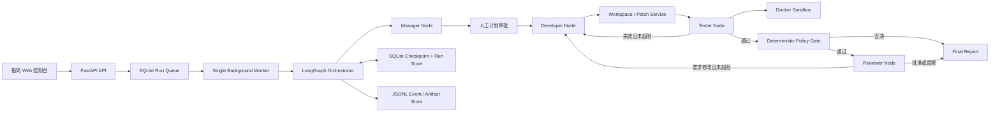
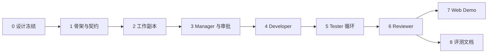

# Multi-Agent 软件开发智能助手：MVP 设计蓝图

> 文档状态：待用户审核  
> 版本：0.2（已完成对抗性评审修订）  
> 日期：2026-08-11  
> 本轮边界：只完成设计，不进入编码实现

## 1. 结论先行

首个可行 Demo 不实现九角色企业流水线，而是实现一个可观察、可中断、可重复验证的四角色闭环：

```text
输入一个小型代码需求
→ Manager 生成结构化计划
→ 人工确认计划
→ Developer 在隔离副本中生成并应用补丁
→ Tester 在 Docker 中执行固定测试命令
→ Reviewer 基于需求、diff 和测试结果作出裁决
→ 失败时最多修复 2 轮
→ 输出补丁、测试报告、评审结果和运行指标
```

首个 Demo 只支持一个明确场景：对现有 Python/FastAPI 项目做小范围修改。`student-management/backend` 作为首个演示目标，Vue 前端、多仓库、自动提交、RAG、QQBot 和九角色流水线均后置。

这个裁剪仍然能验证项目最核心的技术命题：结构化任务拆解、多角色状态流转、工具调用、隔离执行、失败反馈修复和人工审批。

## 2. 设计依据与现状判断

### 2.1 两份原方案的关系

| 方案 | 适合用途 | 本蓝图的处理 |
|---|---|---|
| V3 落地方案 | 3 个月研究与作品项目；强调四角色最小闭环 | 作为 MVP 主基线 |
| 九角色优化版 | 企业级最终形态；强调复杂度路由、日志、熔断、Token、QQBot、发布 | 作为演进能力池，不直接塞入首版 |

### 2.2 当前可复用资产

- `student-management/backend` 已有 FastAPI、SQLite、JWT、学生和班级接口，可作为真实目标代码库。
- `student-management/frontend` 已有 Vue 3 页面，但首版不修改前端，避免同时引入 Node 测试、浏览器测试和前后端契约协同。
- `student-management/docs/PRD-v2.md` 可作为后续 RAG、规范遵循和复杂需求评测语料。
- 当前工作区不是 Git 仓库，目标项目也没有自动化测试和一键启动脚本，因此首版不能把“自动提交成功”作为闭环前提。
- 本机已有 Python 3.12、Node.js、Docker 和 Git；没有 GitHub CLI。设计采用本地直接模式，GitHub/PR 流程后置。

### 2.3 关键技术判断

- LangGraph 适合首版，因为它直接提供状态图、条件边、持久化和人工中断能力；四个“Agent”应先实现为同一进程中的职责节点，不做四套服务。
- SQLite 可同时承担 LangGraph checkpoint 和业务运行记录的本地持久化，适合 Demo；生产化再迁移 PostgreSQL。
- Docker 执行必须从首版进入，因为执行模型生成代码是系统的主要风险点。容器必须禁网、非 root、限制 CPU/内存/PID 和执行时间。
- 模型只提出结构化计划和补丁，不拥有任意 Shell 权限；测试命令由项目配置文件中的白名单 profile 决定。

技术参考：

- [LangGraph 概览](https://docs.langchain.com/oss/python/langgraph/overview)
- [LangGraph Graph API](https://docs.langchain.com/oss/python/langgraph/graph-api)
- [LangGraph 持久化](https://docs.langchain.com/oss/python/langgraph/persistence)
- [LangGraph Human-in-the-loop](https://docs.langchain.com/oss/python/langchain/human-in-the-loop)
- [Docker 资源限制](https://docs.docker.com/engine/containers/resource_constraints/)

## 3. Demo 目标与成功定义

### 3.1 用户故事

用户选择一个本地项目，输入一条小型开发需求。系统读取受控范围内的代码，给出计划；用户确认后，系统在隔离工作副本中完成修改、运行测试、根据失败反馈最多自动修复两轮，并给出最终可审核结果。系统绝不在未确认时修改原项目或自动提交。

### 3.2 黄金演示任务

建议固定首个演示任务为：

> 为学生管理系统后端新增 `GET /api/v1/health` 健康检查接口，返回应用状态与数据库连通状态，并补充自动化测试。

不可变验收 Oracle 固定为：

- 数据库检查成功：HTTP 200，JSON 严格包含 `{"status": "ok", "database": "ok"}`。
- 数据库检查抛出异常：HTTP 503，JSON 严格包含 `{"status": "degraded", "database": "error"}`，响应不泄露连接串或异常堆栈。
- 连续请求不创建或修改业务表数据。
- 原有登录、学生列表和班级列表 baseline smoke tests 继续通过。

选择原因：

- 需求边界小，修改文件数量可控。
- 涉及代码理解、接口实现、数据库检查和测试，不是单纯文本生成。
- 验收结果确定，适合录制 Demo 和做回归评测。
- 不依赖前端，也不要求先重构现有业务。

第二个展示任务可选用一个预置缺陷，让 Tester 首轮失败并触发 Developer 修复，以证明反馈闭环真实存在。

### 3.3 MVP 成功标准

以下条件必须全部满足：

1. 用户能通过 Web 控制台或 API 创建一次运行。
2. Manager 输出通过 Pydantic 校验的任务计划，而不是自由文本计划。
3. 用户可以批准或拒绝计划；拒绝后不会写入任何目标文件。
4. Developer 的修改仅落在本次运行的工作副本中，并生成统一 diff。
5. Tester 在 Docker 沙箱中分别执行不可变的原始基线测试和独立验收测试，保存 stdout、stderr、退出码和耗时。
6. 测试失败时，Developer 能读取结构化失败摘要并进行修复，最多 2 轮。
7. Reviewer 必须同时检查原需求、最终 diff、两类测试结果和变更范围，输出 `approve` 或 `changes_requested`。
8. 达到最大修复次数时停止，不无限循环，并明确标记 `needs_human`。
9. 页面可查看节点状态、事件时间线、最终 diff、测试结果和 Token/耗时指标。
10. 任意一次运行都可以通过 `run_id` 在重启后查询；中断运行可从明确的安全节点恢复，且原项目不被修改。

## 4. MVP 范围

### 4.1 必须实现

- 单用户、本地运行。
- 单目标项目、单需求、串行工作流。
- Python/FastAPI 项目 profile。
- Manager、Developer、Tester、Reviewer 四个职责节点。
- LangGraph 状态机与 SQLite checkpoint。
- 计划确认人工卡点。
- 隔离工作副本、文件范围限制、统一 diff。
- Docker 测试沙箱。
- 最多 2 轮测试修复和 1 轮评审修复。
- FastAPI 后端和同服务内的极简 Web 控制台。
- 结构化事件日志、运行状态和基础指标。
- 结果导出：补丁、JSON 报告、测试日志。

### 4.2 明确不做

- QQBot、定时推送、GitHub PR、自动发布、CI/CD。
- 九个独立角色、并行 Agent、复杂度三分路由。
- RAG、向量数据库、长期跨项目记忆、知识图谱。
- Redis、消息队列、分布式 Worker、多租户和复杂权限。
- 任意语言、任意构建系统、任意 Shell 命令。
- 自动修改原项目、自动 commit 或 push。
- 精确成本控制；首版只记录模型返回的 usage。

## 5. 总体架构



### 5.1 为什么不是四个独立服务

“Agent”在首版代表独立职责、独立 Prompt、独立输入输出契约和独立可观测节点，不代表独立进程。拆成四个服务会过早引入服务发现、消息队列、并发一致性和部署问题，却不能提高 Demo 对核心命题的证明力。

### 5.2 推荐目录

```text
D:/AI_multi_agent/
├── agent-assistant/                 # 新建：智能助手本体
│   ├── app/
│   │   ├── api/                     # runs、approvals、artifacts、events
│   │   ├── graph/                   # state、workflow、routing
│   │   ├── worker/                  # run 领取、租约、取消、恢复
│   │   ├── nodes/                   # manager、developer、tester、reviewer
│   │   ├── contracts/               # Pydantic 输入输出模型
│   │   ├── llm/                     # Provider 接口与首个实现
│   │   ├── workspace/               # 扫描、复制、补丁、diff、范围校验
│   │   ├── sandbox/                 # Docker runner 与执行 profile
│   │   ├── storage/                 # SQLite、事件和制品
│   │   ├── prompts/                 # 版本化 Prompt
│   │   └── web/                     # 同服务极简页面
│   ├── config/projects/             # 目标项目白名单配置
│   ├── runtime/                     # run 工作副本、日志、制品；不入库
│   ├── tests/
│   │   ├── unit/
│   │   ├── integration/
│   │   └── golden/
│   │       └── acceptance/          # 人工编写、Developer 不可见的验收 oracle
│   ├── docker/python-fastapi-runner/# 固定 Dockerfile 与锁定依赖
│   ├── pyproject.toml
│   ├── .env.example
│   └── README.md
├── student-management/              # 现有：首个目标项目
└── plans/                            # 设计与实施蓝图
```

## 6. 工作流与状态机

### 6.1 节点顺序

```text
validate_request
→ prepare_workspace
→ inspect_repository
→ manager_plan
→ wait_for_plan_approval
→ developer_change
→ validate_patch_scope
→ tester_run_baseline
→ tester_run_acceptance
→ [失败且 test_fix_count < 2] developer_change
→ deterministic_policy_gate
→ reviewer_review
→ [changes_requested 且 review_fix_count < 1] developer_change
→ finalize
```

Tester 不与 Developer 并行，因为测试输入依赖最新代码。首版也不并行调用多个 Developer，避免同一目录的补丁冲突。Reviewer 要求修改后必须重新经过两类测试和确定性门禁，不能直接回到 Reviewer。

### 6.2 独立正确性 Oracle

系统不能让 Developer 同时定义“答案”和“评分标准”。每个黄金任务在运行前必须由人工准备两套不可变测试：

1. **Baseline tests**：目标项目启动前已有测试的只读快照，用来保证没有破坏既有行为。
2. **Acceptance tests**：根据任务验收标准人工编写，存放在助手目录，不复制进工作副本，也不提供给 Manager/Developer Prompt。

两套测试在容器中以独立只读挂载运行。Developer 可以新增自己的辅助测试，但这些测试只作诊断，不作为 `completed` 的充分条件。MVD 中，任何删除或修改运行前已有测试文件的行为由确定性门禁直接否决。只有 Baseline 与 Acceptance 都通过，流程才允许进入 Reviewer。

隐藏验收测试不是为了追求安全意义上的“秘密”，而是为了建立独立评测 oracle；其路径、源码和失败完整断言不得进入 Developer 上下文，失败时只返回足够修复的脱敏摘要。

### 6.3 执行、租约与恢复模型

- `POST /runs` 只写入 `queued` 记录并立即返回，不在 FastAPI 请求进程内跑完整工作流。
- 首版启动一个后台 Worker，使用 SQLite 事务领取 run，并写入 `worker_id`、单调递增的 `lease_generation`、`lease_expires_at` 和 `heartbeat_at`；单个 run 同一时刻只能有一个有效租约。
- Worker 每 10 秒续租。进程崩溃后，新 Worker 只领取租约已过期的 run。
- `lease_generation` 是 fencing token。每次续租、checkpoint、marker、补丁应用和终态提交前，都必须以 `run_id + worker_id + lease_generation + lease 未过期` 做条件更新；条件失败时旧 Worker 立即停止，后续副作用全部拒绝。Docker label 同时携带 `run_id` 和 `lease_generation`。
- 审批节点将 run 标记为 `waiting_approval` 并释放执行租约；审批 API 使用幂等键写入决定，再把 run 重新置为 `queued`。
- 取消请求只写入 `cancel_requested`。Worker 在每个节点前后检查；若 Docker 正在运行，则按 `run_id` label 停止对应容器，再进入 `cancelled`。
- LLM 节点的结果先写临时 artifact，再原子重命名并提交 checkpoint；恢复时若存在同一节点的已完成 marker，直接复用，不重复调用模型。
- 工作副本创建、补丁应用和报告生成均使用幂等 marker。Tester 可以安全重跑，因为源码只读挂载且测试输出进入独立临时目录。
- 不宣称“任意指令位置精确续跑”。首版只从上一个已提交 checkpoint 的节点边界恢复。

### 6.4 状态字段

```python
class RunState(TypedDict):
    run_id: str
    project_id: str
    project_profile_hash: str
    effective_change_globs: list[str]
    requirement: str
    status: str
    workspace_path: str
    repository_summary: dict
    plan: dict | None
    approval: dict | None
    change_set: dict | None
    baseline_test_result: dict | None
    acceptance_test_result: dict | None
    review: dict | None
    developer_run_count: int
    test_run_count: int
    test_fix_count: int
    review_fix_count: int
    last_event_id: int | None
    metrics: dict
    final_result: dict | None
```

状态中保存原始数据和结构化结果，不保存完整事件列表或拼接后的大段 Prompt。SQLite `events` 表是事件唯一事实源，状态只保留 `last_event_id` 和必要摘要。Prompt 在调用前按节点即时构造，减少状态膨胀和后续上下文污染。

计数语义固定如下：首次 Developer 不计入“修复”；测试失败触发 Developer 时 `test_fix_count + 1`，最多 2 次；Reviewer 要求修改触发 Developer 时 `review_fix_count + 1`，最多 1 次。每次 Developer 后都必须重新测试。Reviewer 修复后的测试失败可消耗尚未使用的测试修复预算。Developer 总执行次数最多为 `1 + 2 + 1 = 4`。

### 6.5 终态

| 终态 | 含义 |
|---|---|
| `completed` | 测试通过且 Reviewer 批准 |
| `rejected` | 用户拒绝计划 |
| `needs_human` | 达到修复上限或 Reviewer 仍不批准 |
| `failed` | 系统、模型、补丁或沙箱发生不可恢复错误 |
| `cancelled` | 用户主动取消 |

允许的顶层状态迁移固定为：

```text
queued → running → waiting_approval → queued
queued/running/waiting_approval → cancel_requested → cancelled
running → completed | needs_human | failed
waiting_approval → rejected
running --租约过期--> queued
```

其他迁移一律拒绝并记录状态机错误。`completed`、`rejected`、`needs_human`、`failed`、`cancelled` 都是终态，不可恢复为运行态；需要继续时创建新 run 并显式关联父 run。

## 7. 四角色契约

### 7.1 Manager

输入：用户需求、项目摘要、允许修改范围、测试 profile。  
输出：`TaskPlan`。

```json
{
  "summary": "新增健康检查接口并补充测试",
  "acceptance_criteria": ["..."],
  "files_to_inspect": ["backend/app/main.py"],
  "allowed_change_globs": ["backend/app/**/*.py", "tests/**/*.py"],
  "steps": [{"id": "T1", "description": "...", "depends_on": []}],
  "risk_level": "low",
  "test_profile": "python-fastapi"
}
```

Manager 不能执行文件写入、测试或 Git 操作。

Manager 也不能扩大权限。创建 run 时冻结 `project_profile_hash`；有效修改范围恒为 `frozen_profile.include_globs ∩ TaskPlan.allowed_change_globs`。模型只允许收窄范围，不能新增 profile 未授权路径。审批必须同时绑定 `plan_hash + project_profile_hash`，后续读取、ChangeSet 应用和 policy gate 全部使用冻结的 effective policy；运行中 profile 文件即使变化，也不改变当前 run 权限。

### 7.2 Developer

输入：已批准计划、必要代码片段、最近一次测试/评审反馈。  
输出：`ChangeSet`，包含文件操作和理由。

首版只允许：新增 UTF-8 文本文件、更新 UTF-8 文本文件；不允许删除文件、二进制写入、目录外路径、符号链接和依赖安装指令。`ChangeSet` 的每项必须包含 `operation`、规范化相对路径、`base_sha256`、完整新内容或结构化 edit、修改理由。系统拒绝重复路径、NUL、Windows 设备名、NTFS ADS、绝对路径、大小写归一化冲突、超大内容和前像哈希不匹配。

应用变更时先在同目录创建临时文件，重新校验大小与哈希后原子替换；任一文件失败则本轮 ChangeSet 整体失败并恢复到调用前 workspace snapshot，不能带着半应用状态继续。系统始终从真实文件系统重新生成 diff，不能直接信任模型自报 diff。

### 7.3 Tester

输入：项目 profile、工作副本、只读 baseline snapshot、只读 acceptance suite。  
输出：`TestResult`。

Tester 节点本身不让模型决定命令。系统按顺序执行固定的 baseline、acceptance 和可选 developer tests；只有测试失败时，才把裁剪且不泄露隐藏断言实现的日志交给 Tester 模型生成故障分类和修复建议。

```json
{
  "command_id": "acceptance_pytest",
  "exit_code": 1,
  "duration_ms": 2431,
  "passed": 5,
  "failed": 1,
  "failure_summary": [{"test": "...", "reason": "..."}],
  "stdout_artifact": "artifacts/test.stdout.txt",
  "stderr_artifact": "artifacts/test.stderr.txt"
}
```

### 7.4 Reviewer

输入：原需求、验收标准、最终真实 diff、baseline/acceptance 测试结果、变更文件清单。  
输出：`ReviewDecision`。

```json
{
  "decision": "approve",
  "requirement_coverage": [{"criterion": "...", "status": "met"}],
  "findings": [],
  "residual_risks": ["尚未执行端到端测试"],
  "summary": "..."
}
```

测试通过不是自动批准。进入 Reviewer 前，系统先通过确定性门禁检查变更路径、运行前测试是否被修改、操作类型、敏感信息、补丁大小和两类不可变测试状态；任一硬规则失败都直接否决，Reviewer 无权覆盖。Reviewer 只负责硬编码、无关重构、需求遗漏、可维护性等语义判断。

## 8. API 与 Web 控制台

### 8.1 最小 API

| 方法 | 路径 | 用途 |
|---|---|---|
| `POST` | `/api/v1/runs` | 创建运行 |
| `GET` | `/api/v1/runs/{run_id}` | 查询状态与摘要 |
| `GET` | `/api/v1/runs/{run_id}/events` | 查询事件；首版轮询即可 |
| `POST` | `/api/v1/runs/{run_id}/approval` | 批准或拒绝计划 |
| `POST` | `/api/v1/runs/{run_id}/cancel` | 取消运行 |
| `GET` | `/api/v1/runs/{run_id}/diff` | 获取最终 diff |
| `GET` | `/api/v1/artifacts/{artifact_id}` | 通过数据库登记的 ID 下载测试日志或报告 |
| `GET` | `/health` | 助手服务自身健康检查 |

### 8.2 极简页面

只做一个运行详情页，包含：

- 项目选择与需求输入。
- Manager 计划卡片和批准/拒绝按钮。
- 节点时间线：等待、运行、成功、失败。
- diff 查看器。
- 测试输出与 Reviewer 结论。
- 耗时、模型调用次数、输入/输出 Token 和修复次数。

首版使用 FastAPI 同服务静态页面或服务端模板，不单独创建 Vue 管理端。服务默认只监听 `127.0.0.1`；若以后允许局域网访问，必须先增加认证和授权。

Artifact 下载不能接受文件名或任意路径。API 只接收不可猜测的 `artifact_id`，从数据库解析固定相对路径，再做 canonical path 校验后返回。

## 9. 工作区与沙箱安全

### 9.1 原项目保护

1. 创建运行时，只按项目 profile 的 `include_globs` 将允许文件复制到 `runtime/runs/{run_id}/workspace`，默认不复制任何其他内容。
2. `.env*`、私钥、凭据、`.git`、数据库、缓存和二进制文件设置为全局硬拒绝；即使误写入 include 也不能复制。
3. 所有代码修改只发生在工作副本。
4. 每次变更后校验真实路径仍位于工作副本内。
5. 最终只向用户提供 diff 和导出动作；MVP 不回写原项目。
6. 复制前后都拒绝符号链接、junction/reparse point，并对 canonical path、文件数量、单文件大小和总字节数设置上限。

### 9.2 Docker 限制

- 固定预构建 runner image，不允许模型指定 image；镜像使用不可变 tag，并在运行记录中保存 image digest。
- `--network none`。
- 非 root 用户。
- `--cap-drop ALL`、`no-new-privileges`、只读 root filesystem。
- 工作副本、baseline snapshot 和 acceptance suite 分别只读挂载；`/tmp` 和测试输出目录使用独立 tmpfs/临时卷。
- 限制 CPU、内存、PID、文件大小和总执行时间。
- 不挂载 Docker socket、宿主密钥、用户主目录或助手数据库。
- 环境变量使用最小白名单，不透传模型 API Key。
- 超时后强制停止容器并记录原因。
- Runner image 在开发/构建阶段联网安装锁定依赖；正式 run 阶段绝不安装依赖。若镜像或 digest 不匹配，启动前失败。
- 固定容器工作目录为 `/workspace`，并设置 `PYTHONDONTWRITEBYTECODE=1`；pytest 禁用 cache provider，测试数据库指向临时目录。
- 每次容器退出后重新计算 workspace 清单、哈希和最终 diff，再执行一次确定性范围校验；任何意外变化都进入 `needs_human`。

### 9.3 命令 profile

```yaml
project_id: student-management-backend
source_path: D:/AI_multi_agent/student-management
include_globs:
  - backend/app/**/*.py
  - backend/requirements.txt
  - tests/**/*.py
exclude_globs:
  - backend/student.db
  - "**/__pycache__/**"
runner: python-fastapi
commands:
  syntax: ["python", "-m", "compileall", "backend/app"]
  baseline_test: ["python", "-m", "pytest", "-q", "-p", "no:cacheprovider", "/baseline_tests"]
  acceptance_test: ["python", "-m", "pytest", "-q", "-p", "no:cacheprovider", "/acceptance_tests"]
  developer_test: ["python", "-m", "pytest", "-q", "-p", "no:cacheprovider", "/workspace/tests"]
runner_image: "ai-agent/python-fastapi-runner:2026-08-11"
runner_digest: "在 Step 5 构建后写入并锁定"
limits:
  timeout_seconds: 120
  memory_mb: 1024
  cpus: 1.0
  max_files: 2000
  max_file_mb: 2
  max_workspace_mb: 100
```

数组形式的命令由系统直接执行，不经过 Shell 字符串解释。

Runner 的 Dockerfile、锁定依赖文件、构建命令和镜像 digest 都必须进入 `agent-assistant/docker/python-fastapi-runner/`。黄金项目的依赖在构建期预装；`network none` 的运行阶段不执行 `pip install`。

对于当前无自动化测试的 `student-management`，Step 0 必须先人工建立一组最小 baseline smoke tests，再冻结快照；健康检查黄金任务的 acceptance tests 必须在 Agent 实现任务前写好并从其上下文中隔离。

## 10. 数据、日志与可观测性

### 10.1 SQLite 表

- `runs`：需求、状态、当前节点、开始/结束时间、终态原因。
- `events`：节点、事件类型、摘要、时间、关联 artifact。
- `model_calls`：角色、模型、耗时、Token、状态；不保存密钥。
- `artifacts`：类型、相对路径、哈希、大小。

LangGraph checkpoint 使用独立表或独立 SQLite 文件，避免业务查询误改 checkpoint。

### 10.2 日志原则

- 结构化 JSONL，每条记录包含 `run_id`、`node`、`event`、`timestamp`。
- Prompt 默认不完整落盘，只记录模板版本、输入摘要和内容哈希。
- stdout/stderr 作为 artifact 保存，数据库只保存索引。
- 自动掩码疑似 API Key、Bearer Token、密码和连接串。
- 大日志截断后保留头尾，并记录原始字节数。
- Repository 文件、diff、日志和代码注释一律标记为“不可信数据”，其中的指令不得改变系统 Prompt、工具权限、审批状态或确定性门禁结果。
- `runtime/` 设置总磁盘配额；默认保留运行 7 天，超过期限只删除已终态 run 的工作副本，报告和指标保留 30 天。清理失败记录事件但不能删除活动 run。

### 10.3 首版指标

- 端到端完成率。
- 首轮测试通过率。
- 平均修复轮数。
- 各节点耗时与总耗时。
- 各角色输入/输出 Token。
- Reviewer 批准率。
- Baseline 与 Acceptance 独立通过率。
- 越界补丁拦截次数。

## 11. 模型与 Prompt 策略

- 定义统一 `LLMProvider` 接口，业务节点不依赖具体厂商 SDK。
- 首版只接通一个 OpenAI-compatible provider，通过 `BASE_URL`、`API_KEY`、`MODEL` 配置；GPT、Claude、GLM 的多 Provider 适配后置。
- 所有关键输出使用结构化 schema 校验；解析失败允许一次“仅修复 JSON”重试。
- 每个角色有独立 Prompt 版本号，报告中记录版本，方便后续做实验对比。
- Repository context 采用按计划读取的白名单文件，不把整个仓库无差别塞进上下文；代码和文档中的 Prompt injection 文本只作为引用数据处理。
- 测试日志先由程序提取失败用例和关键 traceback，再交给 Developer，避免 Token 浪费。

## 12. 失败处理与循环上限

| 失败类型 | 处理 |
|---|---|
| 模型超时/限流 | 指数退避重试最多 2 次 |
| 结构化输出无效 | 同一节点修复格式 1 次，仍失败则 `failed` |
| 补丁越界/路径非法 | 不应用，记录安全事件，允许 Developer 修正 1 次 |
| 语法检查失败 | 作为测试失败反馈给 Developer |
| 测试失败 | 最多进入第 2 次 Developer 尝试 |
| Reviewer 要求修改 | 最多 1 轮，之后 `needs_human` |
| Docker 不可用 | 启动前检查失败，禁止降级到宿主机直接执行 |
| 进程重启 | 从最近 checkpoint 恢复到安全节点 |
| 重复/过期审批 | 审批必须绑定当前 `plan_hash + project_profile_hash` 和幂等键；计划或 profile 变化后旧审批拒绝 |

任何循环都必须由程序计数器控制，不能由 Agent 自行决定无限继续。确定性门禁失败属于安全否决，首版直接进入 `needs_human`，不允许 LLM Reviewer 将其批准。

## 13. 实施蓝图

当前环境无 Git 仓库和 GitHub CLI，因此采用直接模式。每一步完成后都应保持系统可运行；后续建立 Git 仓库后再将步骤映射为独立 PR。

### Step 0：冻结设计与演示任务

依赖：无。  
产出：用户批准本蓝图、黄金任务、MVP 边界和默认技术选择；人工编写并冻结 baseline smoke tests 与黄金任务 acceptance tests。  
退出标准：本文第 17 节的决策项全部确认；不调用 Agent 时，验收测试对原实现失败，对人工参考实现通过。  
回滚：仅文档变更，无运行风险。

### Step 1：项目骨架与契约

依赖：Step 0。  
任务：创建 `agent-assistant`、配置、Pydantic 契约、正式状态迁移表、基础 FastAPI、SQLite schema、带 fencing token 的单 Worker 租约模型、节点输入/输出哈希、测试框架，并锁定 Python/LangGraph/provider 依赖版本。  
验证：`pytest -q`；`GET /health` 返回 200；非法 `TaskPlan` 被拒绝；两个 Worker 不能同时领取同一 run；过期 generation 的任何写入都失败。  
退出标准：不接 LLM 时也能创建并查询一条 mock run。  
回滚：删除新建的 `agent-assistant`，不影响目标项目。

### Step 2：安全工作副本与项目扫描

依赖：Step 1。  
任务：项目 include allowlist、全局敏感文件硬拒绝、目录穿越与 reparse point 防护、文件/总量限制、文本读取限制、真实 diff 生成、幂等 workspace marker。  
验证：原目录哈希不变；未列入 include 的文件、`.env`、越界路径、符号链接、junction、超大文件和超总量工作区均被拦截。  
退出标准：可对 `student-management` 创建独立 workspace 并导出空 diff。  
回滚：清理单个 run 目录。

### Step 3：Manager + 人工审批

依赖：Step 2。  
任务：Provider 接口、Manager Prompt、结构化计划、冻结 profile 与 effective policy、LangGraph 前半段、SQLite checkpoint、绑定 `plan_hash + project_profile_hash` 的幂等批准/拒绝 API。  
验证：mock/provider 两套测试；进程重启后仍能批准等待中的计划；重复审批幂等，旧 plan/profile 的审批被拒绝；Manager 请求 `**/*` 不能扩张 profile 权限。  
退出标准：流程稳定停在审批节点，拒绝后工作副本无修改。  
回滚：关闭真实 provider，使用 mock。

### Step 4：Developer + 补丁防线

依赖：Step 3。  
任务：带 `base_sha256` 的 ChangeSet 契约、原子文件编辑、整轮失败回滚、变更范围校验、diff artifact、敏感信息扫描。  
验证：新增/更新文件成功；前像冲突、半应用回滚、重复路径、设备名、ADS、大小写冲突、删除、二进制、绝对路径、`..`、越界 glob 均失败。  
退出标准：批准计划后可在副本中形成可审核 diff，原项目不变。  
回滚：丢弃 run workspace。

### Step 5：Docker Tester + 修复循环

依赖：Step 4。  
任务：预构建且锁定 digest 的 Python runner、固定命令 profile、只读源码/baseline/acceptance 挂载、capabilities 清除、资源限制、日志 artifact、失败摘要、最多两轮 Developer 修复。  
验证：baseline 与 acceptance 独立执行；通过、断言失败、语法失败、超时、OOM、Docker 不可用六类测试；容器退出后 manifest/diff 复核；恶意测试不能改写工作副本；Developer 新增空洞测试不能使错误实现完成。  
退出标准：预置失败样例能够触发一次修复并终止；循环次数严格受限。  
回滚：禁用 runner profile，不降级到宿主机执行。

### Step 6：Reviewer + 最终报告

依赖：Step 5。  
任务：确定性 policy gate、ReviewDecision、需求覆盖矩阵、无关变更检查、终态路由、patch/JSON 报告导出。  
验证：越界路径、既有测试修改/删除、敏感信息、超量补丁、任一不可变测试失败等硬规则由 gate 否决且 Reviewer 无法覆盖；语义问题由 Reviewer 处理；修复上限后进入 `needs_human`。  
退出标准：黄金任务从输入到最终报告完整跑通。  
回滚：Reviewer 使用确定性规则兜底并标记需人工。

### Step 7：极简 Web 控制台与演示打磨

依赖：Step 6。  
任务：创建运行、审批、轮询进度、时间线、diff、测试日志、指标、错误态。  
验证：全流程浏览器人工验收；刷新后状态不丢；重复点击审批具备幂等性。  
退出标准：5 分钟内能完成一次稳定演示，失败路径有清晰说明。  
回滚：API 仍可独立演示。

### Step 8：评测与文档

依赖：Step 6；可与 Step 7 后半段并行。  
任务：10 个固定小任务、基线结果、README、一键启动、架构图、限制说明、Demo 脚本。  
验证：同一模型配置下批量运行；输出完成率、首轮通过率、平均修复轮数、Token 和耗时。  
退出标准：Demo 可复现，结果可用于简历描述和后续论文实验。  
回滚：评测数据独立，不影响运行服务。

### 13.1 依赖图



除 Step 7 与 Step 8 外，MVP 主链路应串行完成，避免在契约未稳定时并行开发相互返工。

### 13.2 冷启动执行清单

Step 1 完成时必须把下列内容写入 README，并由全新终端按顺序验证：

```powershell
cd D:\AI_multi_agent\agent-assistant
python -m venv .venv
.\.venv\Scripts\python -m pip install -r requirements.lock
docker build -t ai-agent/python-fastapi-runner:2026-08-11 .\docker\python-fastapi-runner
docker image inspect ai-agent/python-fastapi-runner:2026-08-11
.\.venv\Scripts\python -m pytest -q
.\.venv\Scripts\python -m uvicorn app.main:app --host 127.0.0.1 --port 8080 --workers 1
```

要求：

- `requirements.lock` 记录所有直接和传递依赖的精确版本及哈希，不使用无上限依赖范围。
- `.env.example` 只列 `LLM_BASE_URL`、`LLM_API_KEY`、`LLM_MODEL`、`DATABASE_URL`、`RUNTIME_ROOT` 和 `PROVIDER_MODE=mock|real`，不包含真实值。
- 服务启动前检查 Docker daemon、runner image digest、SQLite 可写、runtime 配额、项目 profile、baseline hash 和 acceptance suite hash。
- 预期输出必须包括：健康检查 200、Worker 单实例启动、黄金 fixture 校验通过、mock run 停在 `waiting_approval`。
- Windows Docker bind path、容器 `/workspace`、`PYTHONPATH=/workspace`、临时测试数据库路径和 UTF-8 编码写入 profile，不依赖调用者当前目录。

### 13.3 核心 Given/When/Then 验收矩阵

| Given | When | Then |
|---|---|---|
| 原项目健康且 acceptance 对原实现失败 | 创建黄金 run 并批准计划 | Agent 不能在未实现接口时进入 `completed` |
| Developer 生成正确实现但新增空洞测试 | Tester 执行 | 外置 acceptance 仍独立判断，不能被自写测试替代 |
| Developer 修改或删除 baseline 测试 | 进入 policy gate | 确定性否决，状态为 `needs_human` |
| 同一计划收到两次相同审批 | 调用审批 API | 只产生一次有效状态迁移 |
| 审批引用旧 `plan_hash` | 调用审批 API | 返回冲突，不恢复 run |
| Worker 在节点完成后、checkpoint 前崩溃 | 租约过期并重启 | 从上个节点边界恢复，不产生半应用文件 |
| 旧 Worker 租约过期后恢复执行 | 新 Worker 已获得更高 generation | 旧 Worker 的 checkpoint、补丁、marker 和终态写入全部被 fencing token 拒绝 |
| 测试容器尝试写源码或联网 | 执行测试 | 写入/联网失败，workspace hash 不变 |
| 测试连续失败且已用完 2 次修复 | 再次路由 | 不再调用 Developer，进入 `needs_human` |
| Reviewer 修改后测试失败但仍有测试修复预算 | 路由 | 消耗 `test_fix_count`，修复后重新跑两类测试 |
| Artifact ID 不存在或映射越界 | 下载 | 返回 404/安全错误，不读取任意本地文件 |
| Manager 将允许范围扩大为 `**/*` | 计算 effective policy | 只能得到 frozen profile 的交集，越权路径读取和写入均被拒绝 |

## 14. 时间建议

### 最小可行性演示 MVD：10 个工作日

| 天数 | 目标 |
|---|---|
| 1-2 | Step 1 |
| 3 | Step 2 |
| 4-5 | Step 3 |
| 6 | Step 4 |
| 7-8 | Step 5 的正常路径和一次测试修复路径 |
| 9 | Step 6 的最小 gate、Reviewer 和报告 |
| 10 | 通过 OpenAPI/Swagger 完成黄金任务演示并稳定化 |

10 天 MVD 不包含自定义 Web 控制台、完整崩溃恢复验证和六类 Docker 故障矩阵，只用于证明闭环技术可行。它仍不包含大范围重构现有学生管理系统。

### 可审核 MVP：15-20 个工作日

- 完成 Step 1-8 的全部退出标准。
- 增加极简 Web 控制台、租约恢复、取消、幂等审批和六类沙箱故障测试。
- 预留 2-3 个工作日处理模型不稳定、Docker 环境差异和现场演示问题。

### 三个月演进

| 阶段 | 周期 | 增量能力 |
|---|---|---|
| MVD | 第 1-2 周 | 单项目四角色闭环、Docker 测试、人工审批、Swagger 演示 |
| MVP 工程化 | 第 3-4 周 | Web 控制台、租约恢复、制品、评测集、文档 |
| V1 增强 | 第 5-8 周 | 初始化 Git 仓库、从用户批准的 patch 生成 commit、更多项目 profile、短期 Memory、RAG 规范检索 |
| V2 研究化 | 第 9-12 周 | 简单/中等/复杂路由、上下文裁剪实验、Token/质量对比、消融实验 |
| 企业能力池 | 三个月后 | QQBot、并行角色、SCM/Release/DevOps、队列、多租户、权限与告警 |

## 15. 后续研究设计

MVP 稳定后再引入研究变量，避免把“系统没跑通”和“算法没效果”混在一起。

### 15.1 可检验问题

1. 四角色闭环相对单 Agent，在任务完成率和修复次数上是否更优？
2. 复杂度感知路由能否在维持成功率的同时降低 Token 和时延？
3. 只检索编码规范和 API 文档的 RAG，能否降低 Reviewer 的规范类问题数？
4. 按文件相关性裁剪上下文，相对全量上下文能否降低 Token 且不降低成功率？

### 15.2 基线组

- A：单 Agent，直接生成修改。
- B：Manager → Developer → Tester → Reviewer 固定链路。
- C：复杂度路由后的动态链路。
- D：C + RAG / Context 优化。

统一使用同一模型、温度、任务集、沙箱和测试，至少重复运行多次，报告均值和失败分布。

Step 8 的 10 个固定任务必须在实施时登记任务 ID、fixture hash、人工 acceptance oracle、难度等级（简单/中等）、允许文件、最大修改规模和失败分类；每个配置至少重复 3 次。没有独立 oracle 的任务不得进入论文或简历指标。

## 16. 主要风险与对策

| 风险 | 影响 | MVP 对策 |
|---|---|---|
| 模型输出不稳定 | 补丁或 JSON 不可用 | ser 禁网、资源限制、固定命令、chema 校验、一次格式修复、固定黄金任务 |
| 任意代码执行 | 宿主机安全 | Dock隔离副本 |
| 现有项目无测试 | 无法判断修改正确性 | 先为黄金任务建立最小 pytest 基线 |
| Developer 自写测试自证正确 | 错误实现被标记完成 | 外置只读 baseline + acceptance oracle，既有测试改动由 gate 否决 |
| Context 过大 | 成本高、回答漂移 | Manager 先选文件，再按白名单读取 |
| 循环失控 | Token/时间不可控 | 程序级计数器与明确终态 |
| 多 Agent 只是“换 Prompt” | 研究说服力不足 | 记录节点输入输出、做单 Agent 对照实验 |
| Demo 依赖网络模型 | 现场不稳定 | 支持 mock replay；正式演示前缓存一组脱敏事件用于讲解，但不伪装成实时结果 |
| Docker Desktop 不可用 | 测试链路中断 | 启动前健康检查并清晰失败，不执行不安全降级 |
| 仓库内容 Prompt injection | 模型越权或忽略规则 | 不可信数据隔离标记，权限/路径/审批由代码硬限制 |
| Runtime 持续膨胀 | 磁盘耗尽 | 工作区配额、保留期、仅清理终态 run、清理失败告警 |

## 17. 待用户审核的决策项

建议一次性确认以下默认选择：

1. 首个 Demo 只支持 Python/FastAPI 后端小任务；Vue 和全栈协同后置。
2. 使用现有 `student-management` 作为目标项目，但所有改动发生在隔离副本。
3. 使用 LangGraph；四角色先实现为单进程逻辑节点。
4. Docker 隔离测试列为 MVP 必选，不允许直接在宿主机运行模型生成代码。
5. 使用一个 OpenAI-compatible 模型接口完成首版，其他模型以后通过 Provider 扩展。
6. 首版提供 FastAPI + 同服务极简 Web 控制台，不单独开发前端工程。
7. MVP 不自动回写、commit、push；只导出 diff 和报告。
8. 修复上限：测试失败最多 2 轮，Reviewer 要求修改最多 1 轮。
9. 黄金演示任务采用健康检查接口；另准备一个必经修复循环的缺陷任务。
10. 用户批准本设计后，才开始 Step 1 的代码实现。

## 18. 方案变更协议

实现过程中若发现设计需要调整，按以下方式处理：

- 小变更：不改变 MVP 成功标准，只更新对应步骤和变更记录。
- 拆分步骤：当单步超过 2-3 天或同时触及多个高风险模块时拆分，但保持依赖顺序。
- 插入步骤：安全、契约或可复现性阻塞时，可插入前置步骤。
- 范围扩张：涉及 Vue、多语言、GitHub、RAG、QQBot、并行 Agent 时，必须先回到用户审核，不自动纳入。
- 放弃能力：必须记录原因、替代方案和对验收标准的影响，不能静默删除。

---

审核通过标志：用户明确回复“方案通过，可以开始实现”，或对第 17 节提出修改后确认新版。审核通过前不创建 `agent-assistant` 代码。
