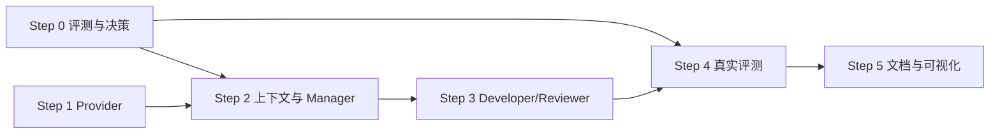

# 真实 LLM 接入与通用 Coding 能力改造方案

> 状态：待用户审核，尚未开始实施  
> 目标项目：`D:\AI_multi_agent\agent-assistant`  
> 目标代码库：`D:\AI_multi_agent\student-management`  
> 编制日期：2026-08-12

## 1. 结论

首版接入 OpenAI Responses API，但保留现有厂商无关的 `LLMProvider` 接口和 Mock 模式。真实模型只负责三类需要语义判断的工作：

1. Manager 分析需求、选择需要读取的文件、形成计划；
2. Developer 输出严格结构化 `ChangeSet`；
3. Reviewer 对真实 diff、验收结果和需求覆盖做独立审查。

Tester 不接 LLM。测试命令、文件权限、补丁应用、循环次数和最终放行继续由本地确定性代码控制。模型不能直接执行 Shell，不能自己选择任意命令，也不能覆盖安全门禁。

本次改造不会把“成功”定义成模型返回了一段看似合理的代码。只有外置只读的 Baseline 与任务专属 Acceptance Pack 都通过，Reviewer 才有资格审批，系统才允许进入 `completed`。

## 2. 当前事实与问题

当前系统不是纯演示壳：它已有真实工作副本、真实文件变更、LangGraph 状态流、SQLite checkpoint、审批、Docker 测试、fencing token 和确定性策略门禁。但智能角色目前使用 `DeterministicMockProvider`：

- Manager 固定生成 health endpoint 计划；
- Developer 固定改写 `backend/app/main.py`；
- Reviewer 按固定测试结果批准或拒绝；
- `PROVIDER_MODE`、`LLM_API_KEY`、`LLM_MODEL` 虽已出现在 `.env.example`，启动入口并未读取并创建真实 Provider；
- Developer 当前会收到全部允许文件，缺少上下文选择和 Token 上限；
- Acceptance tests 仍固定为 health 任务，无法证明任意需求都在真实 Coding。

因此，只增加 API Key 和一段 HTTP 调用是不够的。必须同时改 Provider、上下文组装、任务验收集、可观测性和真实评测。

## 3. 目标边界

### 3.1 本次必须做到

- `PROVIDER_MODE=mock|openai` 可切换，默认仍为 `mock`，真实模式失败时 fail closed；
- 使用官方 Python SDK 的 Responses API 与严格 Structured Outputs，把响应直接校验为现有 Pydantic 契约；
- Manager 先选择上下文，再基于获准文件生成计划，避免把整个项目直接发送给模型；
- Developer 对真实仓库内容生成非预置 `ChangeSet`，系统按现有哈希和路径规则应用到隔离工作副本；
- Reviewer 使用独立 Prompt 审查真实 diff，但不能推翻测试和策略门禁；
- 每个真实 Coding run 绑定一个冻结的 Acceptance Pack；
- 保存角色、模型、Prompt 版本、耗时、Token 用量、请求状态等元数据，但不保存原始源码 Prompt 与供应商原始响应；本地恢复所需的已校验 TaskPlan/ChangeSet 使用受控 artifact 保存；
- 用 3 个公开冻结任务和至少 1 个实施者事先未知的 sealed holdout 完成真实 API → Coding → Docker → Review 纵向评测。

### 3.2 本次不做

- 不让模型直接获得 Shell、Docker、网络浏览或任意文件工具；
- 不做多个模型供应商的完整适配，只保留扩展接口；
- 不做自动合并回原项目；最终仍只提供隔离工作副本与 diff；
- 不用 Developer 自写测试作为完成依据；
- 不在首版实现无限自主循环、向量数据库或全仓语义索引；
- 不把 health 固定任务的通过冒充成通用 Coding 能力。

## 4. 推荐架构


### 4.1 Provider 层

保留厂商无关的 `LLMProvider` 抽象，但不原样保留现有方法签名。新增：

- `OpenAIResponsesProvider`：负责官方 SDK 调用、严格 JSON Schema、超时、有限重试、拒答和错误分类；
- `ProviderFactory`：根据冻结配置选择 Mock 或 OpenAI；
- `PromptRegistry`：按角色加载版本化 Prompt，并记录内容 hash；
- `LLMCallContext`：由 Runtime 创建，携带 `run_id`、lease generation、`call_id`、Prompt 版本、预算预留凭证和取消信号；
- `LLMCallExecutor`：在 SQLite 中原子预留预算，调用 Provider，返回后按同一 generation fenced 结算；
- `LLMCallObserver`：只记录调用元数据与用量，不保存源码内容。

建议的新协议是 `generate(context, role, response_model, payload)`。`context` 不能由模型或 API 请求构造，只能由持有活动租约的 Runtime 从 SQLite 预算预留记录生成。Provider 仍不知道工作区路径，也没有文件写权限。

建议使用 Responses API 的 Structured Outputs，而不是让模型输出 Markdown 再正则提取 JSON。请求固定 `store=false`、`background=false`，SDK 自带自动重试关闭，首版不启用任何远程工具。

### 4.2 模型配置

模型 ID 不写死在代码里，启动时校验用户账号是否可用。首轮评测建议三角色先使用同一个高能力模型，减少变量；评测稳定后再考虑 Manager/Reviewer 使用强模型、Developer 使用 coding 优化模型。

推荐环境变量：

```dotenv
PROVIDER_MODE=openai
OPENAI_API_KEY=只保存在本机环境或未提交的.env
OPENAI_BASE_URL=https://api.openai.com/v1
OPENAI_MANAGER_MODEL=gpt-5.6-terra
OPENAI_DEVELOPER_MODEL=gpt-5.6-terra
OPENAI_REVIEWER_MODEL=gpt-5.6-terra
LLM_REQUEST_TIMEOUT_SECONDS=120
LLM_MAX_CALLS_PER_RUN=8
LLM_MAX_CONTEXT_BYTES=300000
LLM_MAX_TOTAL_TOKENS_PER_RUN=200000
LLM_MAX_ESTIMATED_COST_USD_PER_RUN=5
LLM_STORE_RAW_CONTENT=false
```

`gpt-5.6-terra` 是能力与成本平衡的首选起点；若冻结评测不能 3/3 通过，只把 Developer 升级到 `gpt-5.6-sol` 做对照，不先改验收标准。实施时通过一次最小 Structured Outputs 预检验证账号权限与模型能力；若不可用则由用户指定可用模型，不静默降级。API Key 不进入 SQLite、事件、artifact、日志和前端响应。

### 4.3 两阶段 Manager

当前 Manager 只拿仓库摘要就直接输出计划，真实模型容易猜文件。改为两阶段：

1. `manager_select_context` 输出 `InspectionRequest`，只包含希望查看的相对路径和理由；
2. 本地 `RepositoryContextService` 验证路径属于冻结 profile、不是敏感文件、总大小未超限；
3. `manager_plan` 根据获准文件内容输出 `TaskPlan`；
4. `TaskPlan.files_to_inspect` 必须是实际已提供文件的子集，`allowed_change_globs` 只能收窄冻结权限。

创建 run 时先生成 run 级不可变源码快照；Manager、审批后的 Developer、崩溃恢复以及后续每个 Worker generation 都只能从这份快照重建工作副本，不能重新复制可能已变化的原项目。首版最多允许两轮“选择文件 → 本地读取”，以处理 Manager 第一轮发现 import/依赖后需要补读的情况；达到轮数或上下文预算后必须基于现有证据规划或进入 `needs_human`。审批同时绑定 `source_manifest_hash + context_bundle_hash + plan_hash + project_profile_hash + acceptance_pack_hash`，保证用户批准的源码上下文就是 Developer 后续使用的上下文版本。

仓库文件视为不可信数据。Prompt 明确要求忽略源码注释或 README 中要求泄露密钥、修改策略、执行命令的“指令”。真正的安全仍由本地策略保证，而不是依赖 Prompt。

### 4.4 Developer

Developer 只收到：已批准计划、获准源文件、当前 manifest hash、脱敏测试失败摘要、Reviewer 反馈。它看不到：

- Acceptance test 源码及完整断言；
- `.env`、数据库、密钥、runtime 目录；
- 容器控制接口和任意命令入口；
- profile 之外的文件。

`FileChange.base_sha256` 继续作为乐观锁。模型输出后仍要经过 Pydantic、路径、大小、权限、敏感内容、基线测试不可修改等确定性检查。每次修复前重新读取真实工作副本，不能复用过期文件内容。

### 4.5 Tester 与正确性 Oracle

Tester 继续完全确定性执行。新增 Acceptance Pack Registry：

- `acceptance_pack_id` 映射到助手仓库中的公开规范、只读测试目录、允许项目、版本、`task_spec_hash` 和 `suite_hash`；
- run 创建时冻结 pack hash，审批绑定 `source_manifest_hash + context_bundle_hash + plan_hash + project_profile_hash + acceptance_pack_hash`；
- 评测模式下，run 的需求正文从 pack 的公开规范加载，不能用同一 pack ID 搭配任意其他需求；
- `suite_hash` 覆盖测试全部字节、固定命令、runner image digest、依赖锁文件和双容器 harness；每次执行前重新计算，不一致则 fail closed；
- 未绑定受信 Acceptance Pack 的 run 可以生成计划，但不能进入自动 Coding 完成态；
- pack 源码不复制进工作副本，也不发给任何 LLM；
- 失败只给 Developer 经过裁剪的测试名、错误类别和修复线索。

首版登记 3 个非 health 评测任务，测试先于模型 Coding 编写并冻结，代码答案不写进 Provider：

1. 班级列表增加可选 `grade` 过滤并验证响应行为；
2. 学生列表增加白名单排序字段和升降序参数，非法值返回 422；
3. 修复班级更新响应的 `student_count` 与数据库真实数量不一致问题。

三个公开任务和 sealed holdout 都要满足：原始代码对 acceptance 失败，人工参考实现通过，Mock 默认 fixture 无法通过，而真实 Developer 在不看到测试源码时完成。sealed holdout 的需求只在 Step 0 由用户或独立评测者冻结并密封，开发 Prompt、Provider fixture 和实现人员都不能预先看到；实施完成后才解封运行，且不得为通过 holdout 回改 Prompt 后继续把同一题称为 holdout。

人工参考实现只用于离线校准：验证完 oracle 后保存在模型不可读、project profile 不包含的位置，绝不复制进 run 快照、Prompt、artifact 或评测目录。每个 pack 使用独立临时数据库和独立测试数据，多个 run 之间不得共享状态。

仅把 Acceptance 目录只读挂载到同一个测试容器仍不够，因为被测生成代码可以读取它。首版 FastAPI 项目改为双容器黑盒验收：

1. SUT 容器只挂载工作副本和临时数据库，不挂载 Baseline/Acceptance 源码，也没有外网；
2. Test Driver 容器只读挂载 Acceptance Pack，通过每次 run 独立的内部 Docker network 调用 SUT HTTP API；
3. 两个容器均无宿主网络，测试结束立即删除 network、容器和临时卷；
4. pack 使用随机化数据、性质/变形断言，另外保留一个在实现冻结后才注入的 sealed holdout；
5. “隐藏测试”只降低针对固定断言作弊的机会，不被描述为绝对安全或通用正确性的证明。

### 4.6 Reviewer

Reviewer 获得需求、批准计划、真实 diff、变更文件、Baseline/Acceptance 结果摘要，输出 `ReviewDecision`。它可以指出覆盖不足和残余风险，但：

- 测试未通过时不调用 Reviewer，直接进入有限修复或 `needs_human`；
- policy gate 未通过时 Reviewer 无权批准；
- Reviewer 的 `approve` 不是完成的充分条件，只是最后一个必要条件。

### 4.7 失败、重试与费用上限

- 只对明确未执行的 429 按 `Retry-After` 最多重试 2 次；连接超时、5xx 等计费状态不确定的失败不自动重试，记录为 `billing_unknown` 并进入人工决定；
- 401/403、模型不存在、上下文超限、拒答、结构化输出无效均不盲目重试；
- 每次调用有超时，每个 run 同时限制调用次数、输入/输出总 Token 与估算费用；任一预算耗尽都停止；
- Manager context selection 单次最多输出 2,000 Token，Manager plan 6,000，Developer 20,000，Reviewer 6,000；每个 run 最多 9 个逻辑调用、500,000 输入 Token、110,000 输出 Token、估算 5 美元；
- 达到调用或 Token 上限进入 `needs_human`，不继续烧费用；
- lease 丢失或取消后，即使远端响应稍后返回，也不得提交 artifact、checkpoint 或文件变更。

实际费用以供应商账单为准，估算上限不是账单担保。每次尝试都记录 OpenAI response/request ID、配置模型、响应返回的实际模型、Token 用量和计费状态；若实际模型与评测冻结值不符，该次 run 不计入正式评测。

### 4.8 Checkpoint 与敏感状态

现有 `repository_files`、完整 diff 和 `ChangeSet` 不能继续直接放入 LangGraph checkpoint。改造后：

- Graph state 只保存 `source_snapshot_ref`、`context_bundle_ref/hash`、`changeset_ref/hash`、`diff_ref/hash`、计划/状态摘要和计数器；
- 源码只存在于 run 级本地快照，Prompt 只在调用时于内存组装，供应商原始响应解析后立即丢弃；
- 已校验 TaskPlan/ChangeSet/diff 写入 generation 专属受控 artifact，文件名和数据库登记均由活动 lease fenced；
- LangGraph generation checkpoint 是未发布草稿；只有主 SQLite 中同一事务写入的 `committed_checkpoint_id + generation` 才能作为恢复入口；
- lease 丢失后的迟到响应即使触发旧 generation 的草稿写入，也没有发布指针、不能恢复或产生文件副作用，并由 reaper 清理；草稿中也不含源码正文；
- 增加取消/租约丢失恰好发生在“API 返回、artifact 落盘、checkpoint 发布”各边界的并发测试，并扫描 checkpoint SQLite，确认不存在目标源码片段、Prompt 或 API Key。

## 5. 代码改动清单

### 5.1 新增文件

```text
app/config/llm_settings.py
app/llm/openai_provider.py
app/llm/factory.py
app/llm/executor.py
app/llm/prompts.py
app/prompts/manager_select_context.md
app/prompts/manager_plan.md
app/prompts/developer.md
app/prompts/reviewer.md
app/context/repository.py
app/context/redaction.py
app/acceptance/registry.py
app/checkpoints/fenced_publication.py
config/acceptance-packs/*.yaml
tests/unit/test_openai_provider.py
tests/unit/test_repository_context.py
tests/unit/test_acceptance_registry.py
tests/live/test_openai_vertical_slice.py
tests/evals/<case-id>/acceptance/*.py
```

### 5.2 修改文件

- `app/llm/provider.py`：修改协议以接收 `LLMCallContext`，保留 Mock，把通用错误、调用结果元数据抽离；
- `app/contracts/models.py`：新增 `InspectionRequest`、`LLMCallMetadata`、Acceptance Pack 标识与 hash；
- `app/nodes/roles.py`：拆分两阶段 Manager，Developer 改为受控上下文，Reviewer 增加 Prompt 版本；
- `app/graph/state.py`、`app/graph/workflow.py`：加入上下文选择节点和 pack hash；
- `app/runtime.py`：Provider 注入、上下文刷新、调用预算、lease 后置校验；
- `app/main.py`：启动配置校验和 ProviderFactory；
- `app/api/schemas.py`、`app/api/routes.py`：创建 run 时接收 `acceptance_pack_id`，展示模型调用摘要；
- `app/storage/sqlite.py`：新增 `llm_calls`、预算预留和 checkpoint 发布记录；
- `config/projects/student-management-backend.yaml`：只登记允许的 pack ID，不接受用户提供任意本地路径；
- `.env.example`、`requirements.lock`、`pyproject.toml`、`README.md`：依赖与中文配置说明。

## 6. 实施步骤

当前 `agent-assistant` 目录不是 Git 仓库，GitHub CLI 也未登录，所以本轮采用直接编辑模式，不设计分支和 PR。每一步完成后跑全量测试，Mock 模式始终作为可回滚路径。

### Step 0：冻结真实评测与配置决策

上下文：真实模型不能用它自己编写的测试证明自己正确。

任务：

- 编写并冻结 3 个 Acceptance Pack；
- 验证每个 pack 对原始项目失败、对人工参考实现通过；
- 确认 OpenAI、模型 ID、源码外发和费用上限；
- 确认源码 manifest、上下文 bundle 与 pack hash 都进入审批绑定字段。

退出标准：3 个评测用例具备可重复 oracle，且用户批准第 9 节决策项。

回滚：不影响当前系统；尚未接入真实 Provider。

### Step 1：真实 Provider 与配置

上下文：现有节点只依赖 `LLMProvider`，适合做增量实现。

任务：

- 锁定官方 `openai` Python SDK 版本；
- 实现 `OpenAIResponsesProvider`、配置校验、角色模型映射和 `store=false`；
- 使用严格 Structured Outputs 映射 Pydantic 模型；
- 实现错误分类、仅 429 有限重试、超时不自动重试、API Key 脱敏；
- Provider 单元测试使用假 HTTP/SDK，不消费真实 Token。

验证：

```powershell
python -m pytest -q tests/unit/test_openai_provider.py
python -m pytest -q
```

退出标准：Mock 全回归通过；真实 Provider 的成功、429、超时、401、拒答、非法 schema 均有测试；所有失败尝试都结算预算状态。

回滚：`PROVIDER_MODE=mock`，删除新增 Provider 不影响工作流契约。

### Step 2：受控上下文与两阶段 Manager

上下文：不能把所有允许文件无差别发送给远端模型。

任务：

- 新增安全仓库索引、文件大小预算、二进制/敏感内容拒绝；
- 创建 run 级不可变源码快照，所有 generation 只从该快照恢复；
- 新增 `InspectionRequest`；
- 工作流改为选择上下文 → 本地校验/读取 → 生成计划；
- Prompt 与源码分隔，并加入 repository prompt-injection 防护说明；
- 审批新增 `source_manifest_hash`、`context_bundle_hash`、`acceptance_pack_hash` 绑定。

验证：恶意 Manager 请求 `.env`、`../`、profile 外文件、超大文件、重复文件均被确定性拒绝；请求 `**/*` 不能扩大权限。

退出标准：Manager 基于真实获准源码生成可审批计划，模型永远收不到隐藏验收测试和敏感文件。

回滚：工作流切回旧 ManagerNode，Provider 仍可保持 Mock。

### Step 3：真实 Developer、Reviewer 与调用审计

上下文：Developer 必须改真实复制工作区，Reviewer 必须看到真实 diff。

任务：

- Developer Prompt 输出严格 `ChangeSet`，每轮读取最新文件与 hash；
- Reviewer Prompt 输出严格 `ReviewDecision`；
- LLM 调用前后执行 lease/cancel 校验；
- Graph state 改为 artifact 引用，增加 generation checkpoint 发布指针；
- 记录角色、模型、Prompt hash、Token、耗时、状态、错误类别；
- 增加 run 级调用/Token 上限；
- 原始源码 Prompt 和完整响应默认不落盘。

退出标准：使用 Fake Provider 的集成测试证明 Manager/Developer/Reviewer 输入边界正确；过期 Worker 的迟到响应不能产生已发布 checkpoint、artifact 或文件副作用；checkpoint 数据库扫描不到源码与 API Key。

回滚：Mock Provider 仍可完成原 health 流程。

### Step 4：Acceptance Pack Registry 与真实纵向评测

上下文：这是区分“真的 Coding”与“看起来像 Coding”的验收门。

任务：

- 实现 pack registry、hash 冻结、API 参数，以及只在 Test Driver 容器中的只读测试挂载；
- 实现 SUT/Test Driver 双容器黑盒执行，SUT 容器不可见 Acceptance 源码；
- 对 3 个固定任务分别运行真实模型；
- 留存输入任务、模型元数据、计划、diff、测试结果、Reviewer 结论和费用；
- 确认任何任务失败都不会被标记 `completed`。

退出标准：

- 3 个公开任务和 1 个 sealed holdout 的 Baseline 与 Acceptance 全部通过；
- 三份 diff 均由真实 LLM 生成且不包含预置答案；
- 原始项目 hash 不变；
- Acceptance 源码未出现在任何 LLM 调用、事件或 artifact 中；
- SUT 容器内不存在 Acceptance 挂载路径，且 sealed holdout 在实现冻结后才加入；
- 服务重启、取消、超时和模型错误均保持已有安全语义。

回滚：禁用对应 pack 或切换 Mock；不自动写回原项目。

### Step 5：中文使用说明与可视化

任务：

- README 增加“Mock 演示”和“真实 LLM Coding”两套启动说明；
- 页面/事件流明确显示 Provider、模型、真实/Mock 标识、每个角色输入摘要、Token/耗时、diff 和测试证据；
- API Key 只在本机 `.env` 配置，不通过页面提交；
- 增加一条从创建 run 到审核 diff 的完整中文操作路径。

退出标准：用户可肉眼确认每一轮是哪个真实角色调用、模型生成了什么结构化结果、系统实际改了哪些文件、何种测试证明它正确。

回滚：UI 字段为只读展示，不改变核心状态机。

## 7. 依赖关系与预计工期



- Step 0 与 Step 1 可并行，其他步骤串行；
- 预计 8–11 个工作日，其中 2–3 天用于真实纵向评测与稳定化；
- 若真实模型反复达不到 3/3，通过改 Prompt 或上下文策略迭代，但不能修改已冻结验收标准来迁就模型。

## 8. 交付验收矩阵

| Given | When | Then |
|---|---|---|
| `PROVIDER_MODE=mock` | 启动并运行 health 任务 | 不联网，保持当前确定性流程 |
| `PROVIDER_MODE=openai` 且配置有效 | 创建真实任务 | 事件显示真实 provider/model/request metadata |
| 模型返回非契约 JSON | Provider 校验 | 有限重试后 fail closed，不应用文件 |
| Manager 请求 profile 外文件 | 上下文解析 | 确定性拒绝，不把内容发给模型 |
| 审批等待期间原项目发生变化 | 恢复 Coding | 仍从已批准的 run 级源码快照执行，不混用新源码 |
| Developer 输出过期 hash | 应用 ChangeSet | 原子拒绝，不产生部分修改 |
| Developer 写空洞测试 | 执行测试 | 外置 Acceptance 仍独立判定 |
| Acceptance 未通过 | 进入 Reviewer 前 | 有预算则修复，无预算则 `needs_human`，绝不 `completed` |
| Policy gate 失败但 Reviewer approve | 汇总结果 | 仍拒绝完成 |
| Worker lease 丢失时远端响应返回 | 尝试提交 | 响应被丢弃，无已发布 checkpoint、artifact、文件或状态副作用 |
| 生成代码尝试读取 `/acceptance_tests` | SUT 执行 | 路径不存在；测试只在独立 Driver 容器中，通过内部网络黑盒调用 |
| API Key 出现在异常文本 | 记录错误 | 自动脱敏，日志与 API 响应中不可见 |
| 真实任务完成 | 查看 run | 可见计划、模型元数据、diff、两套测试和审查证据 |

## 9. 待用户审核的决策

若无异议，建议批准以下默认项：

1. 首个真实 Provider 使用 OpenAI Responses API，其他厂商后置；
2. 三角色首轮使用同一模型，推荐从账号可用的 `gpt-5.6-terra` 开始；若评测不足，只把 Developer 升到 `gpt-5.6-sol` 做对照，模型 ID 均由环境变量配置；
3. 允许把经过 allowlist 和敏感信息扫描的源码片段发送给 OpenAI；请求设置 `store=false`，但接受供应商仍可能存在默认滥用监控保留策略；
4. API Key 由用户自己写入本机环境或未提交的 `.env`，不在聊天、页面或数据库中传递；
5. 真实 Coding 首版只对已登记 Acceptance Pack 的任务自动完成；没有独立 oracle 的自由任务最多生成计划并等待人工补充验收；
6. 每个 run 最多 9 次逻辑模型调用、500,000 输入 Token、110,000 输出 Token和 5 美元估算上限；任一上限达到即进入 `needs_human`，计费状态不明的超时不自动重试；
7. 通过标准为 3 个公开独立任务与 1 个实施者事先未知的 sealed holdout 全部完成真实纵向闭环，不再以 health 固定任务作为唯一证据；
8. 继续禁止自动写回原项目，用户审核 diff 后再决定是否人工应用。

## 10. 方案变更与实施纪律

- 本文审核通过前不实施真实 Provider；
- 实施中若修改模型、数据外发范围、验收 oracle 或自动写回策略，必须再次请用户确认；
- 已冻结 Acceptance Pack 只能新增版本，不能静默修改原版本；
- 每个 Step 完成后更新本文状态、实际测试证据和偏差记录；
- 任何真实评测失败都保留证据，不用 Mock replay 冒充实时模型结果。

## 11. 官方依据

- OpenAI Ric 定义 Structuesponses API 支持以 JSON Schema/Pydantred Outputs，并能程序化识别拒答；
- 当前模型目录建议复杂 Coding 使用 `gpt-5.6-sol`，能力/成本平衡使用 `gpt-5.6-terra`；
- OpenAI API 数据默认不用于训练（除非主动选择共享），但默认滥用监控可能保留内容；Responses 请求必须显式设置 `store=false`，本方案仍按源码会离开本机处理并要求用户确认。
